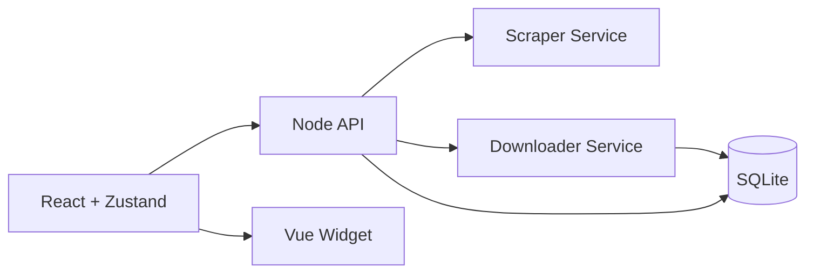

# DATA_FLOW-000

```mermaid
flowchart LR
UI[React + Zustand] --> API[Node API]
UI --> VUE[Vue Widget]
API --> SCRAPE[Scraper Service]
API --> DL[Downloader Service]
DL --> SQL[(SQLite)]
API --> SQL
```
