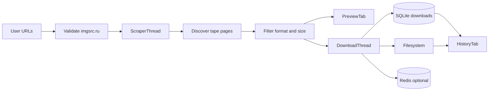

# DATA_FLOW-000

Rules:
- Apenas `.webp`/`.gif` entram na fila de download.
- `.jpg`/`.png` sao descartadas como miniaturas.
- `sync_folders` marca `status=deleted` quando arquivo some do disco.
- Inicializacao limpa SQLite/Redis (`clear_cache=True`).
