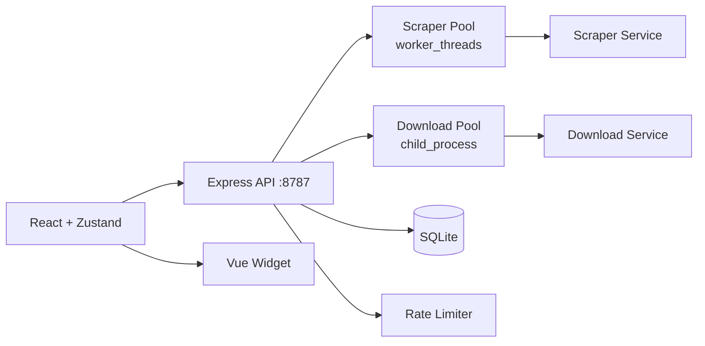

# Sugestões de Ferramentas Internas

## 1. 🔎 Contexto Extraído da Documentação

### Stack Tecnológica

| Camada | Tecnologia |
|--------|------------|
| Backend | Node.js + TypeScript + Express + SQLite (better-sqlite3) |
| Frontend | React + Vite + Tailwind + Zustand + Vue (custom element) |
| Workers | `worker_threads` (scraper) + `child_process` (download) |
| Testes | Vitest + Supertest |
| Qualidade | ESLint v9 (flat config), Prettier, CI GitHub Actions |

### Domínios de Negócio

| Domínio | Descrição | Evidência |
|---------|-----------|-----------|
| Scraping | Extração de galleries do imgsrc.ru | [`/api/scrape`](docs/architecture/IPC_API_CONTRACTS-000.md:7), `scrapeGalleries()` |
| Download | Download em massa paralelo | [`/api/download`](docs/architecture/IPC_API_CONTRACTS-000.md:8), `downloadImages()` |
| Jobs Assíncronos | Fila de jobs com polling | `POST /api/jobs/download`, `GET /api/jobs/:jobId` |
| Histórico | Persistência SQLite com paginação | [`GET /api/history`](docs/architecture/IPC_API_CONTRACTS-000.md:12), `listHistoryPage()` |
| Telemetria | Métricas p50/p95/p99, throughput | [`/api/metrics?windowSec&detailed`](docs/architecture/IPC_API_CONTRACTS-000.md:15) |
| Rate-Limiting | Rolling window por host | Middleware em [`apps/api/src/middleware/rateLimit.ts`](apps/api/src/middleware/rateLimit.ts) |

### Arquitetura Atual

---

## 2. 💡 Ideias de Ferramentas e Utilitários

### 2.1 Ferramentas para Desenvolvedores

#### Scraper Playground CLI

| Atributo | Descrição |
|----------|-----------|
| **O que faz** | Interface CLI interativa para testar payloads de scrape sem usar o frontend, com validação inline e preview do resultado. |
| **Dor resolvida** | Desenvolvimento de debug de scraper exige ir até a UI ou criar scripts temporários. Sem feedback rápido durante iteração de payloads. |
| **Evidência** | Contratos em [`IPC_API_CONTRACTS-000.md`](docs/architecture/IPC_API_CONTRACTS-000.md:7) mostram `urls[]`, `minSizeKb`, `scrapeThreads`, `urlWorkers`. |
| **Conexão** | Usa `/api/scrape` e `/api/jobs/scrape` existentes. |
| **Impacto** | Médio |
| **Originalidade** | Incomum |

#### Job Replay Utility

| Atributo | Descrição |
|----------|-----------|
| **O que faz** | Reexecuta jobs failed ou antigos com um click, permitindo modificar parâmetros antes de reenviar. |
| **Dor resolvida** | Quando um job falha, não há como "replay" com ajustes. Usuário precisa reenchergar os dados manualmente. |
| **Evidência** | `GET /api/jobs/download/:jobId` retorna `status`, `error`, `result` — mas não há endpoint para reexecução. |
| **Conexão** | Integra com sistema de jobs existente. |
| **Impacto** | Médio |
| **Originalidade** | Incomum |

---

### 2.2 Ferramentas Operacionais

#### Queue Health Dashboard

| Atributo | Descrição |
|----------|-----------|
| **O que faz** | Dashboard visual minimalista (pode ser endpoint dedicado) que mostra estado atual de todas as filas — jobs pending, running, failed, completed — com alertas visuais para anomalias (ex: jobs > 1h em "running"). |
| **Dor resolvida** | Para saber saúde das filas, preciso chamar múltiplos endpoints ou abrir UI completa. Sem visão consolidada de "saúde operacional". |
| **Evidência** | [`/api/metrics`](docs/architecture/IPC_API_CONTRACTS-000.md:15) retorna `queue: { download, scrape }` com stats, mas sem agregação de "saúde". |
| **Conexão** | Consome `/api/metrics`, `/api/jobs/scrape`, `/api/jobs/download`. |
| **Impacto** | Alto |
| **Originalidade** | Comum |

#### Rate Limit Visualizer

| Atributo | Descrição |
|----------|-----------|
| **O que faz** | Visualização em tempo real dos rate-limit buckets por host: quem está proximo do limite, quem foi bloqueado, histórico de bloqueios na janela atual. |
| **Dor resolvida** | Rate limiting está implementado (v2.3.0), mas sem visibilidade. Usuário não sabe quais hosts estão prestes a bloquear. |
| **Evidência** | [`RateLimitStats`](docs/architecture/IPC_API_CONTRACTS-000.md:204-212) retorna `topHosts` com `requests` e `blocked`, porém sem "proximidade ao limite" ou timeline. |
| **Conexão** | Extende `/api/metrics?detailed=true`. |
| **Impacto** | Alto |
| **Originalidade** | Incomum |

#### Download Budget Estimator

| Atributo | Descrição |
|----------|-----------|
| **O que faz** | Dado um total de imagens, calcula ETA e recursos necessários com base no throughput atual e histórico. |
| **Dor resolvida** | Usuário quer saber "quanto tempo vai demorar" antes de iniciar download massivo. Sem ferramenta de estimativa baseada em dados reais. |
| **Evidência** | [`ThroughputMetrics`](docs/architecture/IPC_API_CONTRACTS-000.md:198-202) expõe `imagesPerSecond`, mas não há "estimador" que use isso para prever. |
| **Conexão** | Consome `/api/metrics` para throughput real. |
| **Impacto** | Médio |
| **Originalidade** | Raro |

---

### 2.3 Utilitários Transversais

#### Smart Preset Manager

| Atributo | Descrição |
|----------|-----------|
| **O que faz** | Permite salvar, nomear e versionar presets de operação (ex: "scraping-rapido", "download-noturno") com validação de schema. Presets podem ser carregados via API ou UI. |
| **Dor resolvida** | UI atual tem "presets" (mencionado em [`FEAT-002`](docs/features/FEAT-002-Neo_Editorial_Mission_Control_UI.md:24)), mas não há persistência ou versionamento estruturado. Cada vez que usuário configura parâmetros, precisa redigitar. |
| **Evidência** | Command Palette com "presets" existe na UI v2.2.0, mas sem backend dedicado para armazenar/recuperar. |
| **Conexão** | SQLite + endpoints REST para CRUD de presets. |
| **Impacto** | Médio |
| **Originalidade** | Incomum |

#### History Deduplicator

| Atributo | Descrição |
|----------|-----------|
| **O que faz** | Escaneia o histórico de downloads e identifica imagens duplicadas (por URL, hash de tamanho+nome, ou metadados) com ações: listar, remover, exportar relatório. |
| **Dor resolvida** | Não há visibilidade de duplicatas no histórico. Usuário pode unknowingly rediscar imagens já baixadas. |
| **Evidência** | [`GET /api/history`](docs/architecture/IPC_API_CONTRACTS-000.md:12) retorna items, mas sem análise de duplicatas. |
| **Conexão** | SQL query sobre tabela de histórico. |
| **Impacto** | Médio |
| **Originalidade** | Raro |

---

## 3. 🧩 Ideias Não Óbvias (Fora do Padrão)

### Ideia 1: Scraper Fingerprint Detector

| Atributo | Descrição |
|----------|-----------|
| **O que faz** | Analisa patterns de scraping (headers, timing, User-Agent) e detecta se o target está aplicando mudanças que indicam possível detecção/bloqueio. Alerta proativo. |
| **Dor resolvida** | O sistema tolera falhas parciais (RFC-002), mas não detecta sinais sutis de que o target está mudando comportamento (mudança de DOM, new headers, timeout patterns). |
| **Evidência** | [`RFC-002`](docs/architecture/RFC-002-Distributed_Rate_Limit_and_Workers.md:9) cita "Evitar banimento de IP" — mas a detecção é reativa (rate-limit), não proativa. |
| **Originalidade** | Raro |

### Ideia 2: Worker Hot-Reload Configurator

| Atributo | Descrição |
|----------|-----------|
| **O que faz** | Sem reiniciar o servidor, permite ajustar configurações de workers (min/max workers, idle timeout, parallel downloads) via endpoint API e ver impacto imediato em métricas. |
| **Dor resolvida** | Para mudar `downloadsParallel` ou `idleTimeoutMs`, precisa restartar API. Sem dinamismo operacional. |
| **Evidência** | [`WorkerPoolConfig`](docs/architecture/IPC_API_CONTRACTS-000.md:103-109) existe em contract mas só é lido na inicialização. |
| **Originalidade** | Raro |

### Ideia 3: Error Pattern Classifier

| Atributo | Descrição |
|----------|-----------|
| **O que faz** | Classifica erros recorrentes em categorias (timeout, auth, rate-limit, parse) e sugere ações automáticas ou manuais baseadas em histórico de erros similar. |
| **Dor resolvida** | Erros retornam `message` genérica. Não há análise de padrões para sugerir solução (ex: "esse host geralmente desbloqueia em 5min"). |
| **Evidência** | [`WorkerResponse.error`](docs/architecture/IPC_API_CONTRACTS-000.md:95-98) tem `code` e `message`, mas sem layer de inteligência sobre eles. |
| **Originalidade** | Raro |

### Ideia 4: Operation Recipe Recorder

| Atributo | Descrição |
|----------|-----------|
| **O que faz** | Grava sequências de operações (scrape → filter → download) como "receita" reutilizável. Permite replay com um clique. Similar a macros. |
| **Dor resolvida** | Fluxos complexos exigem sequência manual de ações. Não há como "salvar" um fluxo completo. |
| **Evidência** | Command Palette com "ações de execução" existe em FEAT-002, mas sem "gravação" de sequências multi-step. |
| **Originalidade** | Raro |

### Ideia 5: Download Provenance Tracker

| Atributo | Descrição |
|----------|-----------|
| **O que faz** | Para cada imagem baixada, registra não apenas "onde foi baixada" mas a cadeia completa: URL original → redirects → final URL → cookies usados → timing. Útil para debug e reprodutibilidade. |
| **Dor resolvida** | Histórico salva URL e destinação, mas não a "jornada" do download. Quando algo falha, não há como reproduzir exatamente. |
| **Evidência** | [`ScrapedImage`](docs/architecture/IPC_API_CONTRACTS-000.md:42-47) tem `url`, `size`, `user`, `title` — sem tracking de redirect chain. |
| **Originalidade** | Raro |

---

## 4. 🔗 Combinações e Sinergias

| Combinação | Resultado |
|------------|-----------|
| Queue Health Dashboard + Rate Limit Visualizer | Painel operacional unificado "Mission Control" para monitoramento em tempo real |
| Smart Preset Manager + Operation Recipe Recorder | Sistema de automação de fluxos com presets nomeados e graváveis |
| Error Pattern Classifier + Download Budget Estimator | Advisor de operação que prevê problemas e sugere timing/recursos |
| Job Replay + History Deduplicator | Ferramenta de "limpeza e retry" para manutenção do histórico |

---

## 5. ⚠️ Ideias Enganosas (Descartar)

| Ideia Descartada | Motivo |
|------------------|--------|
| "Exportador JSON/XML genérico" | Já existe `/api/history/export` em CSV. Formatos adicionais não agregam valor real neste contexto. |
| "Dashboard de analytics genérico" | Métricas já existem em `/api/metrics`. Mais dashboards sem ação não resolve dor operacional. |
| "Teste de stress automático" | O sistema não tem volume de produção que justifique isso. E2E com Playwright já está no roadmap. |
| "Autenticação e autorização" | Não existe no contexto atual e adicionaria complexidade desnecessária. O sistema é interno. |

---

## 6. 📊 Priorização

### Top 3 Ideias

| # | Ferramenta | Justificativa |
|---|-----------|---------------|
| 1 | **Rate Limit Visualizer** | Resolve invisibilidade de algo crítico (rate-limit) que está implementado na v2.3.0 mas sem observabilidade. Alto impacto prático, conecta diretamente com telemetria existente. |
| 2 | **Error Pattern Classifier** | Agrega inteligência sobre erros que hoje são opaque. Baseado em contratos existentes (`error.code`, `error.message`) e pode evoluir para sugestões automáticas. |
| 3 | **Operation Recipe Recorder** | Resolve dor real defluxos repetitivos sem precisar reenchergar manualmente. Une Command Palette (existente) com gravação de sequências. |

---

### Suposições Explicitadas

1. **Escopo**: Assumo que o sistema é para uso interno/single-user. Não há necessidade de multi-tenant ou autenticação.
2. **Volume**: Assumo operação em escala média (dezenas a centenas de downloads por sessão), não enterprise.
3. **Infra**: Não há Redis ou serviços externos. Qualquer solução deve rodar no SQLite ou memória do processo.
4. **Futuro**: A próxima RFC (RFC-003) está em aberto conforme [`.kilo/STATE.md`](.kilo/STATE.md:23) — estas ideias podem ser candidatas.
